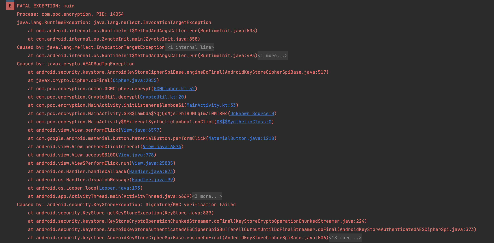

The current project aims to show data input limits for AES-GCM encryption.

For testing so you need:
Success scenario:
1) Launch the app
2) Click "Encode" button
3) Click "Decode" button
4) It show work properly on Android 6.0 / 7.0 /8.0 / 9.0

Limitation scenario:
1) Open MainActivity 
2) Comment line 43 and uncomment line 42
3) Launch the app 
4) Click "Encode" button 
5) Click "Decode" button
6) Check the logs. You will see javax.crypto.AEADBadTagException

Emulator settings:
For testing I used Pixel 6 API 28 device with default params

The record with results:
[demo videos](attachments/demo_video.gif)

The screenshot with error:

